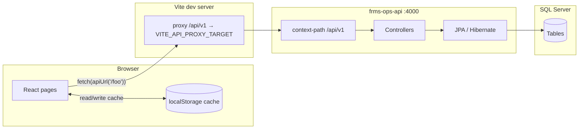

# Frontend ↔ backend ↔ database (how this repo is wired)

The admin SPA, `frms-ops-api`, and MSSQL are meant to work as **one stack**: same REST contract (see **`docs/API_CONTRACT.md`**), table names aligned with JPA entities, and browser **`localStorage`** as a cache when live repositories merge API responses after mutations.

## Request path (dev)

- **Browser URL:** `http://localhost:5173` (typical Vite port).
- **API base:** `VITE_API_BASE_PATH=/api/v1` → same-origin `fetch('/api/v1/...')`.
- **Vite** (`vite.config.ts`) proxies **`/api/v1`** → **`VITE_API_PROXY_TARGET`** (default `http://127.0.0.1:4000`).
- **Spring Boot** `server.servlet.context-path: /api/v1` — controller `@RequestMapping("/beneficiaries")` is **`/api/v1/beneficiaries`** from the browser.

## Merge checklist (DB + API + SPA)

1. **Database:** Run `database/mssql/00_create_database.sql` on `master`, then apply DDL in order (see **`database/mssql/README.md` §2** or **`database/mssql/build_database.ps1`**).
2. **JDBC:** Set `FRMS_JDBC_URL` / `FRMS_DB_USER` / `FRMS_DB_PASSWORD` (see **`.env.example`**). `databaseName` must be **`frms_ops`**. Dev may use Hibernate **`ddl-auto: update`** (`server/frms-ops-api/.../application.yml`) so tables sync without every script.
3. **API:** Start **`server/frms-ops-api`** on port **4000** (or your chosen port).
4. **SPA:** Copy **`.env.example`** → **`.env`**, set **`VITE_USE_LIVE_API=true`**, **`VITE_API_BASE_PATH=/api/v1`**, **`VITE_API_PROXY_TARGET`** to the API base URL (no `/api/v1` suffix). Run **`npm run dev`**.
5. **Verify:** **`GET /api/v1/health`** via Integrations demo or curl; open a feature page (e.g. **Settlement & regulatory**, **Block remittance reports**) and confirm network calls return **200**.

## Environment variables

| Layer | Variables |
|-------|-----------|
| **Dashboard** | `VITE_USE_LIVE_API`, `VITE_API_BASE_PATH`, `VITE_API_PROXY_TARGET`, optional `VITE_API_BEARER_TOKEN` — **`.env.example`**. |
| **Java** | `FRMS_JDBC_*` — comments in **`.env.example`**. |

## Full stack map (DDL order = `build_database.ps1`)

All REST paths below are **relative to** `/api/v1` (add prefix in the browser).

| MSSQL script | Tables (main) | Java (`server/frms-ops-api`) | REST prefix | TS live client / merge layer | UI routes (examples) |
|--------------|---------------|------------------------------|-------------|------------------------------|------------------------|
| `00_create_database.sql` | Database `frms_ops` | — | — | — | — |
| `operations_hub.sql` | `ops_notification`, `ops_email_outbox`, `ops_feedback_log` | `notification`, `outbox`, `feedback` | `/operations/notifications`, `/operations/email-outbox`, `/operations/feedback-log` | `operationsHubRepository`, `operationsHubClient` | `/operations/hub` |
| `masters_aml.sql` | `masters_beneficiary` (+ audit), `masters_agent` (+ audit), `masters_cover_fund`, `compliance_aml_alert` | `masters.*`, `compliance` | `/beneficiaries`, `/agents`, `/cover-funds`, `/compliance/alerts` | `mastersRepository`, `amlRepository` | `/masters/*`, `/compliance/alerts` |
| `investigation_cases.sql` | `investigation_case`, `investigation_case_note` | `cases` | `/investigation-cases` | `caseRepository` | `/operations/investigation-cases` |
| `bulk_hub_log.sql` | `bulk_hub_event` | `bulk` | `/bulk-hub/events` | `bulkHubRepository` | `/operations/bulk-data-hub` |
| `settlement_regulatory.sql` | `settlement_week_stat`, `settlement_bilateral_position`, `regulatory_package` | `settlementreg` | `/settlement`, `/regulatory/packages` | `settlementRepository`, `regulatoryRepository` | `/operations/settlement-regulatory` |
| `remittance_approval_queue.sql` | `remittance_queue_item` | `remittance` | `/remittances` (queue + approve/reject) | `remittanceQueueRepository` | `/remittance/queue` |
| `disbursement_worklist.sql` | `disbursement_item`, `disbursement_audit` | `disbursement` | `/disbursements` | `src/api/live/client.ts` | `/remittance/disbursement` |
| `beftn_ack_processing.sql` | `beftn_ack_file`, `beftn_ack_row` | `beftn` | `/exchange-house/beftn-acks` | `src/api/live/client.ts` | `/exchange-house/beftn-ack` |
| `remittance_tracking_mla.sql` | `remittance_record`, `frms_mla_settings`, `frms_eh_entry_sequence`, … | `remittance.track`, `compliance.mla` | `/remittances/records`, `/remittances/single-entry`, `/compliance/mla-settings` | `liveListRemittances`, single-entry fns, MLA repo | `/remittance/search`, `/exchange-house/single-entry`, `/compliance/mla-settings` |
| `blocked_remittance_report.sql` | `eh_blocked_remittance` | `remittance.blocked` | `/exchange-house/blocked-remittances` | `blockedRemittanceRepository` | `/exchange-house/blocked-reports` |
| `incentive_distribution.sql` | `finance_incentive_distribution_batch` | `finance` | `/finance/incentive-distribution/*` | `liveListIncentiveDistributionBatches`, `liveAccrueIncentiveDistributionBatch`, `liveAdvanceIncentiveDistributionBatch` | `/finance/incentive-distribution` |
| `corporate_file_mapping.sql` | `corporate_file_mapping_profile`, `corporate_file_mapping_defaults`, `corporate_incentive_tier` | `corporate` | `/corporate-file-mapping/*` | `src/api/live/client.ts` | `/tools/corporate-file-mapping` |
| `security_utilities.sql` | `security_utility_event` | `security` | `/security/utilities/*` | `liveComputeLuhnCheckDigit`, `liveValidateLuhnReference`, `liveListSecurityUtilityEvents` | `/tools/security-utilities` |
| `security_vapt.sql` | `security_vapt_finding` | `security` | `/security/vapt/findings` | `liveListVaptFindings`, `liveCreateVaptFinding`, `livePatchVaptFinding`, `liveDeleteVaptFinding` | `/tools/security-vapt` |

**Also implemented without a dedicated DDL file** (or cross-cutting):

| Concern | Java | REST | TS |
|---------|------|------|-----|
| Health | `HealthController` | `GET /health` | `pingFrmsDevHealth` (dev) |
| Dashboard metrics | `metrics.DashboardMetricsController` | `GET /metrics/dashboard` | `liveDashboardMetrics` |
| Party screening | `compliance.ComplianceScreenController` | `POST /compliance/screen` | `liveScreenParties` |
| MLA settings row | `compliance.mla` | `GET\|PATCH /compliance/mla-settings` | `liveGetMlaSettings`, `livePatchMlaSettings` |
| Ops delivery (email/push) | `delivery` | `/operations/delivery/*` | env URLs + ops hub |

## Example: settlement & regulatory (#31 / #32)

| Piece | Location |
|-------|----------|
| DDL | `database/mssql/settlement_regulatory.sql` |
| Entities / REST | `server/frms-ops-api/.../settlementreg/` |
| HTTP | `GET /settlement/week-stats`, `GET /settlement/bilateral-positions`, `GET\|POST /regulatory/packages`, `PATCH /regulatory/packages/:id/advance` |
| TS merge | `src/integrations/settlementRegulatory/` |
| Live client | `src/api/live/client.ts` |
| UI | `/operations/settlement-regulatory` → `SettlementRegulatoryDemoPage` |

## Smoke test

1. Create **`frms_ops`** and apply DDL (or rely on Hibernate `ddl-auto: update`).
2. Run **`frms-ops-api`**; set dashboard **`.env`** with **`VITE_USE_LIVE_API=true`** and proxy target to the API.
3. Open **Integrations (demo)** → use **GET /metrics/dashboard**, **GET /settlement/week-stats**, etc., or open **Block remittance reports** / **Search & Tracking** and confirm **`/api/v1/...`** returns **200**.

## Troubleshooting (link / merge)

| Symptom | Check |
|---------|--------|
| **404** on `/api/v1/...` | Vite `server.proxy['/api/v1']` and Spring `context-path` both **`/api/v1`**. |
| **Connection refused** | API process listening on `VITE_API_PROXY_TARGET`. |
| **DB / unknown database** | `00_create_database.sql`; JDBC `databaseName=frms_ops`. |
| **CORS** | Use Vite proxy (same-origin `/api/v1`), not raw `localhost:4000` from the browser unless CORS is enabled on the API. |
| **Empty tables** | Seed components run on `ApplicationReadyEvent`; or use SQL seeds in DDL / Hibernate `ddl-auto`. |

**Authoritative indexes:** **`database/mssql/README.md`** (per-script table ↔ package ↔ UI), **`docs/API_CONTRACT.md`** (every REST method).
